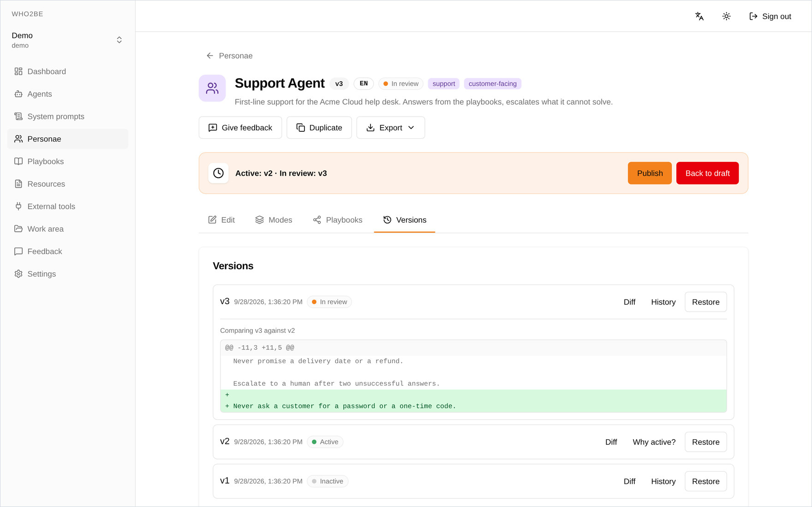

<h1 align="center">
  <picture>
    <source media="(prefers-color-scheme: dark)" srcset="docs/assets/brand/logo-dark.svg">
    <source media="(prefers-color-scheme: light)" srcset="docs/assets/brand/logo-light.svg">
    
  </picture>
</h1>

<p align="center"><strong>Agent configuration you review — not agent behavior you hope for.</strong></p>

<p align="center">
  Self-hosted hub for the personas, playbooks and knowledge your agents run on —
  versioned, reviewed, and served to them over MCP.
</p>

<p align="center">
  <a href="https://github.com/luetzey/who2be/actions/workflows/ci.yml"></a>
  <a href="LICENSE"></a>
</p>

<p align="center">
  <a href="#quickstart">Quickstart</a> ·
  <a href="#connect-an-mcp-client">Connect an agent</a> ·
  <a href="#documentation">Documentation</a> ·
  <a href="CHANGELOG.md">Changelog</a> ·
  <a href="https://github.com/luetzey/who2be/discussions">Discussions</a>
</p>

<p align="center">
  <!-- screenshot: 2026-09-28, commit baf4da69 + contrast fix from #688, persona detail → Versions, diff v2 → v3, demo data -->
  <a href="docs/assets/screenshots/version-review-light.png">
    
  </a>
</p>

## Why Who2Be

Instead of scattering system prompts, workflows, and knowledge documents
across chat histories, notes, or repositories, Who2Be keeps them in one
self-hosted configuration store (the "AgentDB") and serves them to your
agents at runtime through an MCP server.

- **Stop re-typing the same instructions.** Personas, playbooks and reference
  knowledge live in one place, and every agent loads them from there at
  runtime.
- **See what each agent runs on.** Every agent is one persona, one system
  prompt template and an explicit tool policy, and every change leaves a
  version and a status trail.
- **Standards over probability.** A new version starts as a draft and has to
  pass review before it goes live; there is no shortcut from draft to active.
  Agents can propose changes, but by default they cannot publish them.

## Features

- **Personas** — an agent's identity, tone, boundaries, and modes, versioned
  with a status workflow and diff view
- **Playbooks** — step-by-step workflows with trigger keywords, composable
  into composite bundles
- **Resources** — knowledge documents with a block editor (BlockNote),
  block refs, and reverse lookups
- **Agents** — concrete agent configurations with an expanded system prompt,
  tool policy, and curated long-term memory
- **System prompt templates & external tools** — reusable prompt building
  blocks and MCP tool bindings with `tool-ref` placeholders
- **Review workflow** — every version moves draft → review → active (and
  later inactive); draft → active is not a permitted transition. Putting a
  version live takes the admin role, each change is recorded in a status
  history, and any two versions can be diffed or an earlier one restored
- **MCP server** — 85 tools: read, write, full-text + semantic search,
  discovery, and the feedback flywheel (`record_usage`/`submit_feedback`);
  connect via stdio or the OAuth 2.1 remote connector, e.g. to Claude Code
  or Claude.ai. Writing personas, playbooks, resources or agents is off per
  agent until you enable it
- **Agent work area & knowledge base** — an unversioned workspace per agent
  (notes, file/URL ingest, read-only SQL tables, timeline) next to the
  curated resource axis, plus an evidence-backed knowledge base with typed
  edges; promotion into resources is an explicit step
- **Multi-tenancy & RBAC** — organizations → workspaces, roles
  `admin > editor > viewer`, magic-link invitations, MFA step-up
- **Two editions from one codebase** — on-prem (signed license key) and
  cloud (billing package), isolated at build time

The design decisions behind these features are recorded as ADRs in
[`docs/adr/`](docs/adr/).

## Quickstart

**Docker is the only prerequisite** — no Python, no Node, no `.env` file.

```bash
git clone https://github.com/luetzey/who2be.git && cd who2be
docker compose up -d --wait
```

Open <http://localhost:5173>, create an account (sign-ups are auto-confirmed
locally, so no mail server is involved), and you land in a personal workspace
that is created on first login.

Useful follow-ups:

```bash
bash scripts/smoke.sh      # end-to-end check: API, web, auth, MCP tools
docker compose logs -f api # what the backend is doing
docker compose down        # stop; add -v to also drop the database volume
```

The first start builds the API and web images from source, which takes a few
minutes. To pull prebuilt images instead:

```bash
docker compose -f docker-compose.yml -f docker-compose.images.yml up -d --wait
```

### Connect an MCP client

The MCP server runs in the stack as well, on `http://localhost:8765/mcp`
(Streamable HTTP, ADR-0034) and behind the web origin at `/mcp`. It
authenticates with an ordinary Who2Be token, so no OAuth setup is needed:

1. In the web UI go to **Settings → Tokens**, create a token (`w2b_…`) and copy
   the ready-made client configuration shown next to it.
2. Or wire it up by hand, e.g. for Claude Code:

   ```bash
   claude mcp add --transport http who2be http://localhost:8765/mcp \
     --header "Authorization: Bearer $W2B_TOKEN"
   ```

Running the server over stdio from a source checkout is still possible and is
described in [`docs/mcp-claude-code.md`](docs/mcp-claude-code.md).

### Access from another device

The web UI talks to whatever origin it was loaded from — the container's nginx
forwards `/v1/` and `/auth/v1/` internally — so a LAN address works without a
rebuild. Point the backend at the same address so CORS, auth redirects, and
invitation links match:

```bash
WHO2BE_PUBLIC_URL=http://192.168.1.42:5173 docker compose up -d --wait
```

Then open `http://192.168.1.42:5173` from any device on the network. Serving
Who2Be beyond a trusted network needs the hardened setup with TLS —
see [`deploy/hetzner/README.md`](deploy/hetzner/README.md).

### Troubleshooting

| Symptom | Cause and fix |
|---|---|
| `port is already allocated` | Something else uses 5173/8000/9999/5432. Stop it, or change the host port in `docker-compose.yml`. |
| Web loads, but "API unreachable" | The API container is unhealthy: `docker compose logs api`. |
| Login fails from a LAN address | `WHO2BE_PUBLIC_URL` was not set to that address — see above. |
| File upload returns 503 | The blob store is optional and off unless `WHO2BE_BLOBSTORE_*` is set (`.env.example`). Everything else works without it. |
| MCP client reports 401 | Expected without a token — add `Authorization: Bearer w2b_…`. HTML instead of a 401 means you are hitting the SPA, not the MCP endpoint. |

## Documentation

- [`docs/mcp-claude-code.md`](docs/mcp-claude-code.md) — connect an agent:
  Claude Code/Claude.ai over HTTP or stdio (German)
- [`deploy/hetzner/README.md`](deploy/hetzner/README.md) — production
  deployment (Compose, Caddy, backups, runbook) (German)
- [`docs/README.md`](docs/README.md) — documentation index (all of `docs/`)
  (German)
- [`docs/reference/openapi.json`](docs/reference/openapi.json) — versioned
  OpenAPI spec of the REST API (regenerate via
  `uv run python scripts/export_openapi.py`); interactive docs at `/docs`
  on a running API
- [`docs/adr/`](docs/adr/) — architecture decision records (German)
- [`docs/standards/`](docs/standards/) — engineering standards
  (architecture, coding, testing, security, frontend, compliance) (German)
- [`docs/frontend/design-language.md`](docs/frontend/design-language.md) —
  the "Warm Citrus" design language (German)
- [`ROADMAP.md`](ROADMAP.md) — what is done and what comes next

## Architecture

| Component | Path | Stack |
|---|---|---|
| REST API | `apps/api/` | FastAPI, `/v1/workspaces/{ws_id}/...` |
| MCP server | `apps/mcp/` | FastMCP (stdio + HTTP/OAuth) |
| Web UI | `apps/web/` | Vite + React 18 + TypeScript, Tailwind v4, shadcn |
| Shared models | `packages/models/` | Pydantic |
| Cloud billing (optional) | `packages/billing/` | Mollie; cloud build only |
| Blob store | `apps/api/.../blobstore/` | SeaweedFS (S3-compatible, Apache-2.0) / in-memory adapter, content-addressed (ADR-0048) |
| Table store | `apps/api/.../tablestore/` | SQLite per work area, read-only query engine (ADR-0049) |
| Database | — | Supabase (Postgres), locally via Docker Compose |
| Deployment | `deploy/hetzner/` | Docker Compose + Caddy (auto-HTTPS) |

Python runs as a uv workspace in the repo root; architecture decisions are
documented as ADRs under [`docs/adr/`](docs/adr/).

## Contributing

Workflow, conventions, the planned contributor license agreement, and the
definition of done (lint, typecheck, tests with a coverage ratchet, license
gates) are described in [`CONTRIBUTING.md`](CONTRIBUTING.md). Questions and
ideas are welcome in [Discussions](https://github.com/luetzey/who2be/discussions).

### Development setup

For working on the code you need [uv](https://docs.astral.sh/uv/) and Node 22
(pinned in `.nvmrc` / `mise.toml`, see
[`CONTRIBUTING.md`](CONTRIBUTING.md#definition-of-done)) in addition to Docker:

```bash
cp .env.example .env                          # the defaults match Compose
docker compose up -d db auth auth-gateway     # infrastructure only
uv sync                                       # Python dependencies (on-prem core)
uv run uvicorn who2be_api.main:app --reload   # API on :8000
cd apps/web && npm ci && npm run dev          # web UI on :5173
```

Start the MCP server: `uv run python -m who2be_mcp.server` — for connecting
Claude Code/Claude.ai see [`docs/mcp-claude-code.md`](docs/mcp-claude-code.md).
Cloud edition (including billing): `uv sync --group billing`.

Please do not report security vulnerabilities publicly — see
[`SECURITY.md`](SECURITY.md).

Repo setup for Claude Code: `CLAUDE.md`, `.claude/`, and
`docs/CLAUDE-PROFILE.md`.

## License

Licensed under the
[Functional Source License 1.1 (Apache 2.0 Future)](LICENSE) — free for
internal use, no competing hosting; every release automatically becomes
Apache 2.0 two years after publication. Third-party licenses:
[`THIRD-PARTY-LICENSES.md`](THIRD-PARTY-LICENSES.md). For a commercial
enterprise license: <luetzey@gmail.com>.
