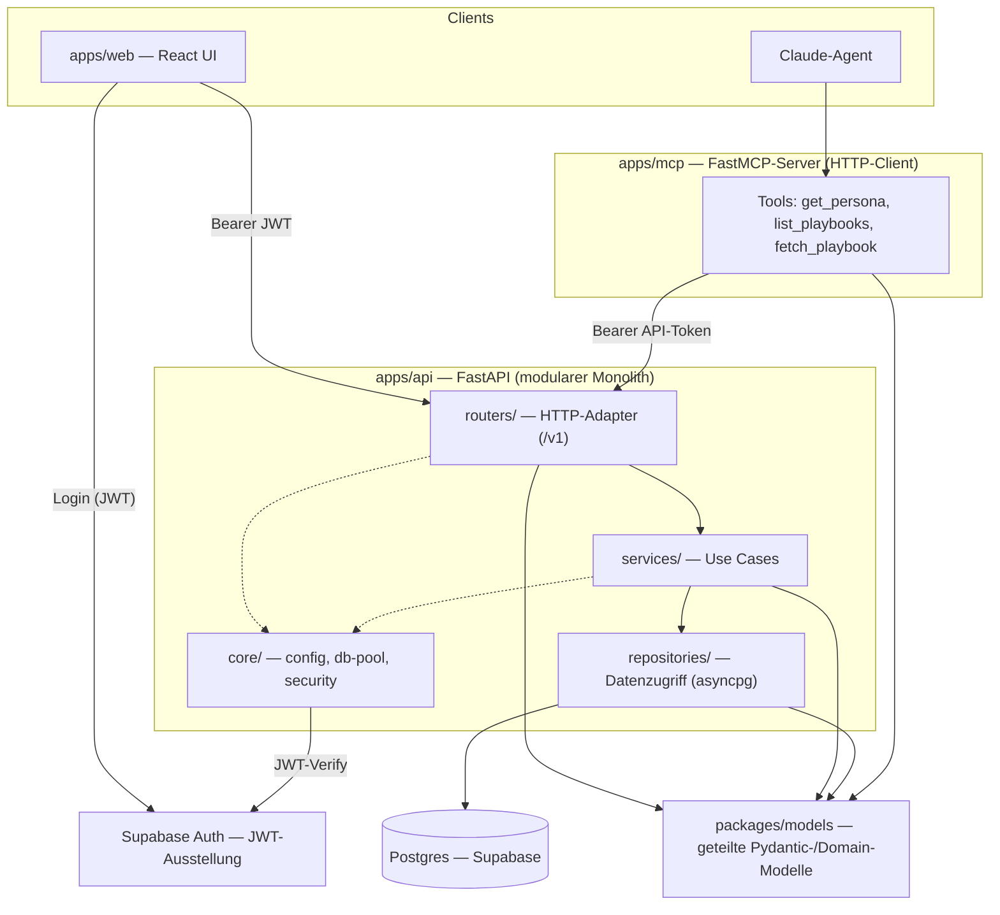
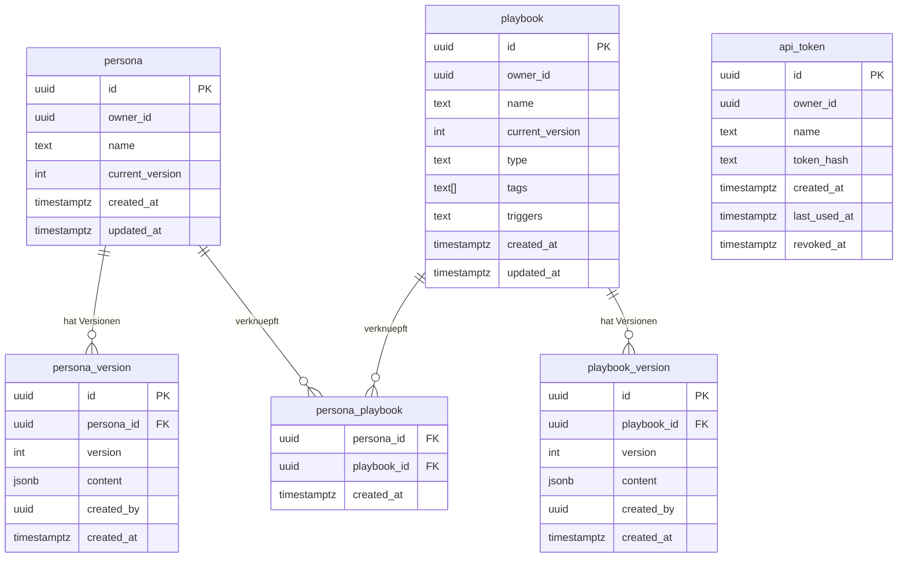
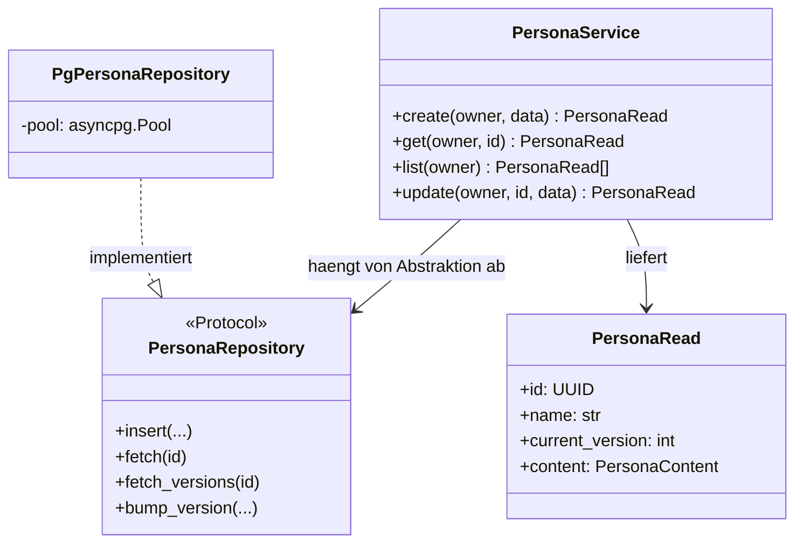

# Who2Be — Architektur-Blueprint (MVP)

> Upfront-Blueprint fuer den MVP (Notion-Projekt PROJ-19). Living document —
> wird bei tragenden Aenderungen aktualisiert. Tragende Einzelentscheidungen
> liegen als ADR unter `docs/adr/`.
>
> Stand: 2026-05-21 · Phase 0 (lauffaehiges Geruest) abgeschlossen.

## 1. Ziel & Geltungsbereich

Who2Be ist eine selbst-gehostete AgentDB fuer versionierte Persona- und
Playbook-Verwaltung. Der MVP liefert:

- REST-API (FastAPI) fuer CRUD auf Persona, Playbook und deren Verknuepfung,
  mit Versionierung bei jedem Update.
- MCP-Server (FastMCP) mit den Tools `get_persona`, `list_playbooks`
  (Tag-/Trigger-Filter), `fetch_playbook`.
- Minimale Web-UI (React): Login, Liste, simpler Detail-Editor.
- Auth: Supabase Auth (Email/Passwort + JWT) fuer die Web-UI, eine eigene
  gehashte API-Token-Tabelle fuer Agenten.
- Hosting: lokal via Docker-Compose, Ziel Hetzner self-hosted Supabase.

**MVP-Completion-Condition** (abgeleitet aus Outcome + Acceptance Criteria):
Der Brainstormer-Stack (1 Persona + 5 Playbooks) laeuft komplett auf einer
Who2Be-Instanz statt aus Notion — im echten Claude-Chat ohne Funktionsverlust;
alle vier Acceptance Criteria sind durch gruene Tests bzw. einen
nachweisbaren End-to-End-Lauf belegt.

Out of Scope (MVP): Verkaufsplattform, Mandanten-Hosting, Mobile App,
komplexes Rollensystem, Vektorisierung der Playbook-Auswahl, Agent-Builder.

## 2. Architektur-Ueberblick

Who2Be ist ein **modularer Monolith** (ADR-0001): die REST-API ist das einzige
Backend und der einzige Datenbank-Eigentuemer. MCP-Server und Web-UI sind
Auslieferungs-Adapter, die ueber HTTP gegen die API sprechen (ADR-0005). So
liegen Geschaeftslogik, Auth und Versionierung an genau einer Stelle.



### 2.1 Schichten (Clean Architecture)

Abhaengigkeiten verlaufen strikt nach innen: `routers → services →
repositories`. `packages/models` ist die innerste, framework-freie Schicht und
wird von allen importiert.

| Schicht | Ort | Verantwortung | Kennt |
|---|---|---|---|
| Domain-Modelle | `packages/models` | Entities + Pydantic-Schemas, keine I/O | nichts |
| Use Cases | `apps/api/.../services` | Geschaeftslogik, Versionierungs-Regel, Owner-Pruefung | models, Repo-Protokolle |
| Datenzugriff | `apps/api/.../repositories` | SQL via asyncpg, Row↔Model-Mapping | models, asyncpg |
| HTTP-Adapter | `apps/api/.../routers` | Request/Response, Auth-Dependency | services, models |
| Infrastruktur | `apps/api/.../core` | Settings, DB-Pool, JWT/Token-Security | — |

`asyncpg` wird ausschliesslich in `repositories` und `core/db` importiert,
`fastapi` ausschliesslich in `routers` und `main`. Der Kern (models, services)
bleibt framework-frei und damit isoliert testbar.

**DIP:** Services haengen von einem Repository-`Protocol` ab, nicht von der
konkreten Postgres-Implementierung. Das erlaubt schnelle Unit-Tests mit
In-Memory-Fakes (siehe Abschnitt 7).

### 2.2 Repo-Struktur (Ziel)

```
apps/api/src/who2be_api/
  main.py              # App-Factory, Router-Registrierung, Lifespan (DB-Pool)
  core/
    config.py          # Settings (pydantic-settings) aus Env
    db.py              # asyncpg-Pool: Lifecycle + Dependency
    security.py        # JWT-Verify, API-Token-Hashing, get_current_user
  repositories/
    persona_repo.py    # PersonaRepository-Protocol + PgPersonaRepository
    playbook_repo.py
    token_repo.py
  services/
    persona_service.py
    playbook_service.py
    token_service.py
  routers/
    health.py · tokens.py · personas.py · playbooks.py
  migrations/
    0001_init.sql · 0002_personas.sql · 0003_playbooks.sql · 0004_links.sql

apps/mcp/src/who2be_mcp/
  server.py            # FastMCP-Tools (duenn)
  client.py            # httpx-Client gegen die Who2Be-API
  config.py            # API-Base-URL + API-Token aus Env

packages/models/src/who2be_models/
  persona.py · playbook.py · token.py · common.py
```

Migrationen liegen bei der API, weil die API der einzige DB-Eigentuemer ist.

## 3. Datenmodell

Versionierung ueber **separate History-Tabellen** (ADR-0004): die
Identitaets-Zeile (`persona` / `playbook`) traegt den aktuellen Stand plus
filterbare, denormalisierte Felder; jeder Update schreibt einen
unveraenderlichen Snapshot in `persona_version` / `playbook_version`.



Hinweise:

- `owner_id` ist die Supabase-Auth-User-UUID (`auth.users.id`). Eine eigene
  User-Tabelle braucht der MVP nicht (Single-User-Owner pro Persona).
- `playbook.tags` / `playbook.triggers` sind aus der aktuellen Version
  denormalisiert, damit `list_playbooks` ohne Join filtern kann; der
  vollstaendige Inhalt liegt im jeweiligen `playbook_version.content`.
- `persona_playbook` ist im MVP eine reine Aktuell-Stand-Verknuepfung und wird
  nicht unabhaengig versioniert (KISS — siehe ADR-0004, Konsequenzen).
- API-Token werden nur als SHA-256-Hash gespeichert; der Klartext wird genau
  einmal bei der Erstellung zurueckgegeben.
- Migrationen: fortlaufend nummerierte SQL-Dateien (`NNNN_<name>.sql`), beim
  App-Start bzw. per Skript idempotent angewandt; eine `schema_migrations`-
  Tabelle haelt den Stand fest.

## 4. Komponenten-Spezifikation

### packages/models
Reine Pydantic-Modelle, keine I/O. Pro Aggregat ein Schema-Satz: `…Create`,
`…Update`, `…Read`, `…VersionRead`. `PersonaContent` / `PlaybookContent`
typisieren das `jsonb`-Feld. Einzige geteilte Abhaengigkeit zwischen API und
MCP (Repo-Konvention).

### apps/api — core
- `config.py`: `Settings` (pydantic-settings) — `DATABASE_URL`, `JWT_SECRET`,
  `SUPABASE_URL`, CORS-Origin. Genau eine Quelle fuer Konfiguration.
- `db.py`: erstellt den `asyncpg`-Pool im FastAPI-Lifespan; stellt ihn als
  Dependency bereit.
- `security.py`: `verify_supabase_jwt` (HS256 gegen `JWT_SECRET`),
  `hash_token`/`new_token`, Dependency `get_current_user` — akzeptiert beide
  Auth-Wege und liefert `owner_id` (ADR-0006).

### apps/api — repositories
Pro Aggregat ein `Protocol` (Service-seitige Abstraktion) plus eine konkrete
`Pg…Repository` mit parametrisierten SQL-Statements. Keine
String-Konkatenation in SQL. Verantwortung: Persistenz + Row↔Model-Mapping,
keine Geschaeftsregeln.

### apps/api — services
- `persona_service` / `playbook_service`: `create`, `get`, `list`, `update`.
  `update` ist atomar: aktuelle Version inkrementieren, Snapshot-Zeile
  einfuegen, denormalisierte Felder aktualisieren — in einer Transaktion.
  Owner-Pruefung serverseitig bei jedem Zugriff.
- `playbook_service.list`: Filter nach `tag` und `trigger` auf den
  denormalisierten Spalten.
- `token_service`: Token erzeugen (Klartext einmalig), listen, widerrufen.

### apps/api — routers (`/v1`)

| Methode & Pfad | Zweck |
|---|---|
| `GET /v1/health` | Liveness (bereits vorhanden) |
| `POST /v1/tokens` | API-Token erstellen — Klartext einmalig |
| `GET /v1/tokens` | Eigene Token listen |
| `DELETE /v1/tokens/{id}` | Token widerrufen |
| `GET /v1/personas` | Eigene Personae listen |
| `POST /v1/personas` | Persona anlegen (Version 1) |
| `GET /v1/personas/{id}` | Persona (aktuelle Version) |
| `PUT /v1/personas/{id}` | Update → neue Version |
| `GET /v1/personas/{id}/versions` | Versionshistorie |
| `GET /v1/personas/{id}/versions/{n}` | Bestimmte Version |
| `GET /v1/personas/{id}/playbooks` | Verknuepfte Playbooks |
| `PUT /v1/personas/{id}/playbooks` | Verknuepfung setzen |
| `GET /v1/playbooks` | Listen, Filter `?tag=&trigger=` |
| `POST /v1/playbooks` | Playbook anlegen (Version 1) |
| `GET /v1/playbooks/{id}` | Playbook (aktuelle Version) |
| `PUT /v1/playbooks/{id}` | Update → neue Version |
| `GET /v1/playbooks/{id}/versions` | Versionshistorie |
| `GET /v1/playbooks/{id}/versions/{n}` | Bestimmte Version |

Register/Login laufen client-seitig direkt gegen Supabase Auth; die API
verifiziert nur das ausgestellte JWT.

### apps/mcp
Duenne FastMCP-Tools, die ueber einen `httpx`-Client gegen die API sprechen
(API-Token aus `WHO2BE_API_TOKEN`):

- `get_persona(name | id)` → `GET /v1/personas/{id}` (inkl. verknuepfter Playbooks)
- `list_playbooks(tag?, trigger?)` → `GET /v1/playbooks?tag=&trigger=`
- `fetch_playbook(id)` → `GET /v1/playbooks/{id}`

Keine Geschaeftslogik im MCP-Server — er ist ein reiner Adapter.

### apps/web
React/TypeScript (Vite): Login (Supabase-JS-SDK), Listen-Ansicht,
Detail-Editor. API-Base-URL ueber `VITE_API_BASE_URL`. Auth-Token nicht im
`localStorage` (siehe react-conventions). Funktion vor Schoenheit.



## 5. Auth-Mechanik

Zwei Wege, eine Dependency (`get_current_user`, ADR-0006):

1. **Web (Supabase-JWT):** Die Web-UI authentifiziert direkt bei Supabase
   Auth und sendet das JWT als `Authorization: Bearer <jwt>`. Die API
   verifiziert es lokal (HS256, `JWT_SECRET`) und liest `sub` als `owner_id`.
2. **Agenten (API-Token):** Der Client sendet `Authorization: Bearer
   w2b_<random>`. Die API hasht den Token (SHA-256) und schlaegt ihn in
   `api_token` nach (nicht widerrufen). `owner_id` kommt aus der Zeile.

Die Unterscheidung erfolgt am Praefix `w2b_`. Jede Persona-/Playbook-Query
filtert serverseitig nach `owner_id` — Zero-Trust, keine implizite Freigabe.

## 6. Sicherheit (querschnittlich)

- Externe Eingaben an der API-Grenze ueber Pydantic validieren.
- Keine ungeparametrisierten SQL-Strings (asyncpg-Parameter-Binding).
- Secrets ausschliesslich ueber Env / `.env` (nicht eingecheckt).
- API-Token nur gehasht gespeichert, Klartext einmalig.
- Owner-Grenzen serverseitig bei jedem Zugriff pruefen.
- Fuer Auth, DB-Zugriff, MCP-Tools und externe Inputs bei der Umsetzung den
  Subagent `security-reviewer` einsetzen (Repo-Vorgabe).

## 7. Test-Plan (Testpyramide)

| Ebene | Umfang | Gegenstand |
|---|---|---|
| Unit (Mehrheit) | schnell, ohne I/O | Services mit In-Memory-Fake-Repos; `security` (JWT-Verify, Token-Hash); Pydantic-Modell-Validierung |
| Integration | gegen echtes Postgres (Docker-Compose-DB) | Repositories; Router via FastAPI-`TestClient`; saubere Migrations-Anwendung |
| E2E (wenige) | gegen laufende Instanz | MCP-Tools gegen die API; Acceptance-Criteria-Fluesse |

Acceptance Criteria → Tests:

- **AC1** (Registrieren/Login + API-Token): Unit-Test JWT-Verify; Integrationstest der `/v1/tokens`-Endpunkte.
- **AC2** (CRUD + Versionen per API): Integrationstests `personas`/`playbooks` inkl. Versions-Erzeugung bei `PUT`.
- **AC3** (MCP laedt Persona, filtert Playbooks): MCP-Integrationstest `get_persona` / `list_playbooks` (Tag-/Trigger-Filter) / `fetch_playbook`.
- **AC4** (Brainstormer auf Who2Be): E2E-Smoke in Phase 4 — Brainstormer-Stack migrieren und im Claude-Chat verifizieren.

TDD-Disziplin: bei Bugfixes zuerst ein reproduzierender, fehlschlagender Test.
DoD pro Stack: `pytest` gruen, `ruff`/`mypy` ohne Findings — bzw. `vitest`,
`eslint`, `tsc` fuer die Web-UI.

## 8. Umsetzungs-Roadmap

Folgt dem Phasing des Notion-Projekts; konkrete Tasks liegen in der Notion-
Tasks-DB von PROJ-19 (44 Eintraege).

- **Phase 0 — Setup** *(abgeschlossen)*: Mono-Repo, Geruest, lokale Postgres.
  Offen: Docker-Compose-Stub durch self-hosted Supabase ersetzen (Task T1).
- **Phase 1 — Core-API:** `core` (config/db/security), Migrationen 0001–0004,
  Modelle, Repositories, Services, Router fuer Token + Persona + Playbook +
  Verknuepfung. Web-UI parallel (Login, Liste, Editor).
- **Phase 2 — MCP:** `client.py` + die drei FastMCP-Tools gegen die API.
- **Phase 3 — Cloud-Deploy:** Hetzner, self-hosted Supabase, Netzwerk-Policy
  Custom + Domain-Allowlist.
- **Phase 4 — Real-Use-Test:** Brainstormer-Stack migrieren, im Claude-Chat
  verifizieren (MVP-Completion-Condition).

## 9. Architecture Decision Records

| ADR | Entscheidung |
|---|---|
| [0001](adr/0001-modularer-monolith.md) | Modularer Monolith statt Microservices |
| [0002](adr/0002-geschichtete-api-architektur.md) | Geschichtete Architektur in `apps/api` |
| [0003](adr/0003-db-zugriff-asyncpg.md) | DB-Zugriff: raw asyncpg + SQL-Migrationen |
| [0004](adr/0004-versionierung-history-tabellen.md) | Versionierung ueber separate History-Tabellen |
| [0005](adr/0005-mcp-als-http-client.md) | MCP-Server als HTTP-Client der REST-API |
| [0006](adr/0006-auth-jwt-und-api-token.md) | Auth: Supabase-JWT + eigene API-Token-Tabelle |
