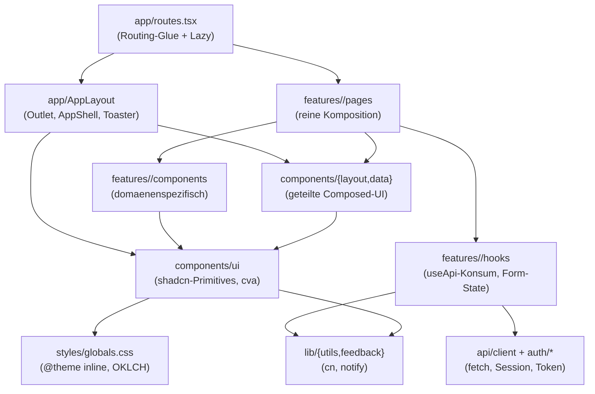

# Frontend-Architektur (Web-UI)

> Living document. Stand: 2026-05-27 · Frontend-Umbau Phasen 0–7
> abgeschlossen ([Migrations-Plan](./migration-plan.md)). Tragende
> Einzelentscheidungen liegen als ADR unter `docs/adr/0014`–`0018`.

Spiegelt die `apps/web/`-Schicht des modularen Monolithen (ADR-0001) und
konkretisiert die **Frontend-Standards** fuer das Repo. Bei Konflikt gewinnt
fuer dieses Repo die `CLAUDE.md`/Skill-Ebene.

## 1. Schichten-Diagramm



**Abhaengigkeitsregel:** jede Schicht nutzt nur die darunter. Pages
komponieren — sie machen keine `fetch`-Calls, kein eigenes Styling und
halten keinen Form-State. UI-Primitives kennen kein Datenmodell und
fuehren keine API-Calls.

## 2. Verzeichnis-Map

| Pfad | Rolle |
|---|---|
| `apps/web/src/app/` | Routing-Wurzel: `routes.tsx`, `AppLayout`, `RouteErrorBoundary`, `RouteFallback`, `ThemeProvider`, `theme-context`. Einziger Mount-Punkt fuer `<AppShell>` und `<Toaster>`. |
| `apps/web/src/app/catalog/` | DEV-only Component-Catalog (`/_catalog`-Route, ADR-0018). `CatalogPage`, `ShowcaseSection`, `showcases/*.tsx`. In Prod-Build 404. |
| `apps/web/src/features/<x>/pages/` | Page-Komponenten, vom Router gemountet. Reine Komposition. |
| `apps/web/src/features/<x>/components/` | Domaenen-spezifische Composed-UI. |
| `apps/web/src/features/<x>/hooks/` | Feature-Hooks (`useXForm`, `useX`). Kapseln `useApi`-Konsum + Form-Adapter. |
| `apps/web/src/features/<x>/lib/` | Domaenen-spezifische Utilities (Schemas, Parser). |
| `apps/web/src/features/<x>/index.ts` | Barrel — exportiert **nur Pages**. |
| `apps/web/src/components/ui/` | shadcn-Primitives. `cva` fuer Varianten, `cn` fuer Klassen-Merge, Radix-Slot fuer Polymorphie. Barrel: `index.ts`. |
| `apps/web/src/components/layout/` | `AppShell`, `Container`, `PageHeader`, `Section`, `Stack`. Barrel: `index.ts`. |
| `apps/web/src/components/data/` | `DataList`, `DataView`, `EmptyState`, `ErrorAlert`, `LoadingState`. Barrel: `index.ts`. |
| `apps/web/src/lib/utils.ts` | `cn()` — einzige Klassen-Merge-Quelle (`clsx` + `tailwind-merge`). |
| `apps/web/src/lib/feedback.ts` | `notify.success/error/info` — einzige Toast-Aufruf-Stelle (wrappt Sonner). |
| `apps/web/src/styles/globals.css` | **Einzige Token-Quelle.** `@import "tailwindcss"` + `@theme inline`. OKLCH (ADR-0014). |
| `apps/web/src/api/` | API-Client + Typen (`client.ts`, `types.ts`, `useApi.ts`). |
| `apps/web/src/auth/` | Session- und Auth-Token-Provider. |
| `apps/web/src/test/setup.ts` | Vitest-Setup + `renderInRoutes` Helper. |

## 3. Single-Source-Tabelle

Jede gestalterische Entscheidung hat **genau einen** legitimen Ort. Wer
einen Wert an zwei Stellen aendert, hat ein Architektur-Problem; dann ist
zu extrahieren statt zu duplizieren.

| Entscheidung | Einzige Quelle |
|---|---|
| Farben, Radius, Typo-Skala, Spacing-Skala | `apps/web/src/styles/globals.css` (`@theme inline` + `:root`). Keine `#hex` oder `px`-Literale im JSX. |
| Erlaubte Varianten einer Primitive | `cva(...)`-Aufruf im jeweiligen `components/ui/*`-File. |
| Layout-Rhythmus (Abstand, Container, Spalten) | `components/layout/{Container,Section,Stack,PageHeader}`. Keine verstreuten `mt-*`/`mb-*` an Einzel-Elementen in Pages oder Feature-Components. |
| Seiten-Chrome (Nav, Header, Theme-Toggle, Toaster) | `app/AppLayout.tsx` + `components/layout/AppShell.tsx`. Pages mounten weder Shell noch Toaster. |
| Daten-Zustaende (Loading, Empty, Error) | `components/data/{DataView,DataList,LoadingState,EmptyState,ErrorAlert}`. Pages nutzen sie, definieren sie nicht. |
| Klassen-Merge | `cn()` aus `lib/utils.ts`. |
| Toast-/Feedback-Aufruf | `lib/feedback.ts` (`notify.success/error/info`). |
| Theme-Schaltung | `app/ThemeProvider.tsx` + `components/ui/theme-toggle.tsx`. `data-theme="light|dark"` auf `<html>`. |
| Form-Pattern | `components/ui/form` + `react-hook-form` + `zod`. Editor-Form-Logik lebt in `features/<x>/hooks/useXForm.ts`. |
| Cross-Feature-Geteiltes | wandert nach `components/` oder `hooks/`. Deep-Imports zwischen Features sind ESLint-Error. |

## 4. ESLint-Gates (verbindlich)

- `no-restricted-syntax` in `features/**`, `components/{layout,data}/**`,
  `app/**`: rohes `<button>`, `<input>`, `<textarea>`, `<a>`, `<label>`
  sind Error. Pflicht-Pendants: Primitives aus `@/components/ui/*` bzw.
  `<Link>` aus `react-router-dom`.
- `no-restricted-imports`: Cross-Feature-Deep-Imports sind Error.
- `no-restricted-imports`: `@/components/layout/AppShell` darf nur aus
  `src/app/**` importiert werden (Phase 2).
- `tailwindcss/no-contradicting-classname` = Error,
  `tailwindcss/classnames-order` = Warn.
- `jsx-a11y/recommended` = Error (Phase 5).

## 5. Definition of Done (Frontend-Aenderung)

Lokal verifiziert vor jedem Push:

```
cd apps/web
npm run lint
npx tsc --noEmit
npm test
npm run build
```

Ab Phase 5 zusaetzlich: `vitest-axe`-Tests fuer Pages laufen mit 0
Violations.
